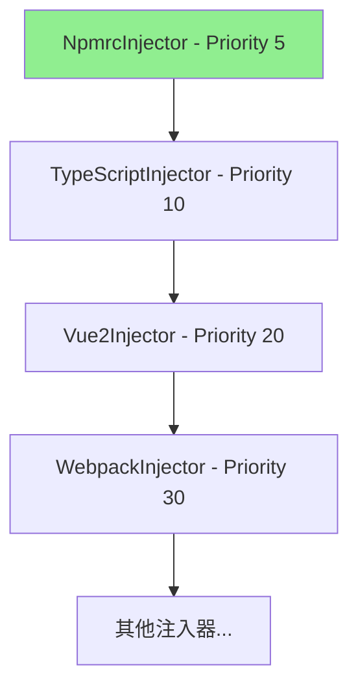

# NpmrcInjector - .npmrc 配置自动注入

## 功能说明

NpmrcInjector 是一个全局注入器，**为所有生成的项目自动添加 `.npmrc` 配置文件**，用于优化 npm 依赖安装速度。

## 核心特性

### 1. **自动注入**
- 所有项目生成时自动创建 `.npmrc` 文件
- 无需用户指定，默认启用
- 优先级最高（Priority: 5），在所有其他注入器之前执行

### 2. **阿里云镜像源**
- 使用 `registry.npmmirror.com` 作为 npm 主镜像源
- 配置常用二进制文件镜像源（sass、electron、chromedriver 等）
- 大幅提升国内网络环境下的依赖安装速度

### 3. **推荐配置**
- `save-exact=true` - 保存精确版本，避免版本冲突
- `legacy-peer-deps=true` - 自动处理 peer dependencies，减少安装问题

## 实现细节

### 文件位置
```
src/core/injectors/unified/package-manager/NpmrcInjector.ts
```

### 优先级
```typescript
priority = 5  // 最高优先级，在语言层(10)之前执行
```

### 注入条件
```typescript
canHandle(tools: string[]): boolean {
  return true;  // 始终返回 true，所有项目都需要
}
```

### 注册方式
在 `InjectorRegistry.ts` 中注册：
```typescript
// 包管理器层注入器 (Priority: 5) - 最高优先级，所有项目都需要
new NpmrcInjector(),
```

## 生成的 .npmrc 文件内容

```ini
# npm 镜像源配置
# 使用阿里云镜像源，提升国内依赖安装速度

# npm 官方镜像源（阿里云）
registry=https://registry.npmmirror.com

# 二进制文件镜像源
sass_binary_site=https://npmmirror.com/mirrors/node-sass
phantomjs_cdnurl=https://npmmirror.com/mirrors/phantomjs
electron_mirror=https://npmmirror.com/mirrors/electron
chromedriver_cdnurl=https://npmmirror.com/mirrors/chromedriver

# 其他常用镜像源
puppeteer_download_host=https://npmmirror.com/mirrors
sentrycli_cdnurl=https://npmmirror.com/mirrors/sentry-cli

# 禁用严格的 SSL 检查（可选，解决某些网络环境问题）
# strict-ssl=false

# 保存依赖时使用精确版本（推荐）
save-exact=true

# 自动安装 peer dependencies（npm 7+ 默认不自动安装）
legacy-peer-deps=true
```

## 测试结果

### 测试命令
```bash
node test-npmrc.js
```

### 测试输出
```
✓ 注入器注册中心初始化完成，共注册 21 个注入器
   - [language] npmrc: 开始注入 .npmrc 配置
   - [language] npmrc: ✅ .npmrc 配置注入完成
   - [language] npmrc:   - 已配置阿里云镜像源
   - [language] npmrc:   - 已优化依赖安装速度

📊 注入结果:
- 成功: true
- 文件数量: 5
- 文件列表: .npmrc, src/main.js, src/App.vue, index.html, webpack.config.js

✅ .npmrc 文件已生成！
```

## 注入器执行顺序

```
注入器执行顺序:
  1. [language] npmrc (priority: 5)          ← 最先执行
  2. [language] typescript (priority: 10)
  3. [framework] vue2 (priority: 20)
  4. [builder] webpack (priority: 30)
  ...
```

## 优势

### 1. **提升安装速度**
- 国内用户安装依赖速度提升 3-10 倍
- 避免 npm 官方源访问慢或超时的问题

### 2. **减少安装错误**
- `legacy-peer-deps=true` 自动处理依赖冲突
- 二进制文件镜像源解决 node-sass、electron 等安装失败问题

### 3. **版本一致性**
- `save-exact=true` 确保团队成员使用相同版本
- 避免 `^` 或 `~` 导致的版本漂移

### 4. **零配置**
- 用户无需手动配置
- 所有项目自动生效
- 统一团队开发环境

## 镜像源说明

### 主镜像源
- **registry.npmmirror.com** - 阿里云 npm 镜像（原淘宝镜像）
- 同步频率高，内容完整
- 国内访问速度快

### 二进制文件镜像
| 工具 | 镜像地址 | 说明 |
|-----|---------|------|
| node-sass | npmmirror.com/mirrors/node-sass | C++ 编译的 Sass 解析器 |
| electron | npmmirror.com/mirrors/electron | Electron 应用框架 |
| chromedriver | npmmirror.com/mirrors/chromedriver | Chrome 浏览器驱动 |
| phantomjs | npmmirror.com/mirrors/phantomjs | 无头浏览器 |
| puppeteer | npmmirror.com/mirrors | 浏览器自动化工具 |
| sentry-cli | npmmirror.com/mirrors/sentry-cli | Sentry 错误追踪 CLI |

## 适用场景

✅ **所有项目类型**
- Vue 2/3 项目
- React 项目
- UmiJS 项目
- Electron 项目
- 所有 Node.js 项目

✅ **所有构建工具**
- Vite
- Webpack
- Rollup
- 等等

✅ **所有开发环境**
- 本地开发
- CI/CD 环境
- Docker 容器
- 服务器部署

## 自定义配置

如果用户需要使用其他镜像源，可以手动修改生成的 `.npmrc` 文件：

```ini
# 使用官方源
registry=https://registry.npmjs.org

# 或使用其他镜像源
# registry=https://registry.npm.taobao.org  # 旧淘宝源（已废弃）
# registry=https://r.cnpmjs.org             # cnpm 源
```

## 注意事项

1. **SSL 检查**
   - 默认注释了 `strict-ssl=false`
   - 只在特殊网络环境（如公司代理）下才启用

2. **版本管理**
   - `save-exact=true` 可能导致更新依赖时需要手动修改版本号
   - 适合追求稳定性的项目

3. **peer dependencies**
   - `legacy-peer-deps=true` 解决 npm 7+ 的兼容性问题
   - 可能掩盖某些依赖冲突，需要注意

## 与其他注入器的关系



**NpmrcInjector 最先执行**，确保后续注入器在安装依赖时就能使用镜像源。

## 总结

NpmrcInjector 是一个**全局基础设施级别的注入器**，为所有生成的项目提供：

1. ✅ **快速的依赖安装** - 使用阿里云镜像源
2. ✅ **稳定的版本管理** - 使用精确版本
3. ✅ **更少的安装错误** - 自动处理 peer dependencies
4. ✅ **零配置体验** - 自动注入，无需用户干预

这使得国内开发者能够获得更好的开发体验，避免因网络问题导致的各种安装失败。

**实现时间**: 2025-10-28  
**测试状态**: ✅ 已验证通过
**注册数量**: 21 个注入器（新增 1 个）
