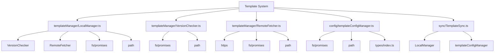
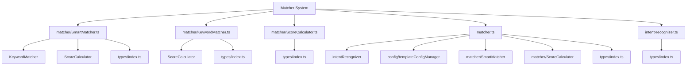
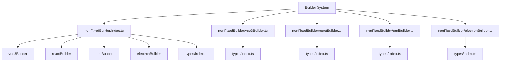
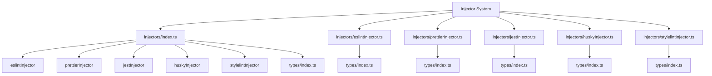
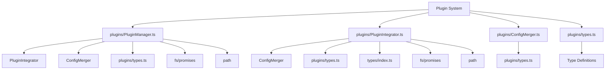
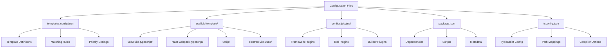

# 依赖关系图

## 从 index.ts 开始的完整依赖树

```mermaid
graph TD
    A[src/index.ts] --> B[tools/generateScaffold.ts]
    A --> C[config/toolSchemas.ts]
    A --> D[utils/ResponseFormatter.ts]
    A --> E[utils/MCPErrorHandler.ts]
    A --> F[utils/MessageTemplates.ts]
    A --> G[types/index.ts]
    
    B --> H[core/matcher.ts]
    B --> I[core/matcher/SmartMatcher.ts]
    B --> J[core/sync/TemplateSync.ts]
    B --> K[core/nonFixedBuilder/index.ts]
    B --> L[core/injectors/index.ts]
    B --> M[tools/projectGenerator.ts]
    B --> N[tools/pathResolver.ts]
    B --> O[types/index.ts]
    
    H --> P[core/intentRecognizer.ts]
    H --> Q[core/config/templateConfigManager.ts]
    H --> R[core/matcher/ScoreCalculator.ts]
    H --> S[types/index.ts]
    
    I --> T[core/matcher/KeywordMatcher.ts]
    I --> U[core/matcher/ScoreCalculator.ts]
    
    T --> V[core/matcher/ScoreCalculator.ts]
    
    J --> W[core/templateManager/LocalManager.ts]
    J --> X[core/config/templateConfigManager.ts]
    
    K --> Y[core/nonFixedBuilder/vue3Builder.ts]
    K --> Z[core/nonFixedBuilder/reactBuilder.ts]
    K --> AA[core/nonFixedBuilder/umiBuilder.ts]
    K --> BB[core/nonFixedBuilder/electronBuilder.ts]
    
    L --> CC[core/injectors/eslintInjector.ts]
    L --> DD[core/injectors/prettierInjector.ts]
    L --> EE[core/injectors/jestInjector.ts]
    L --> FF[core/injectors/huskyInjector.ts]
    L --> GG[core/injectors/stylelintInjector.ts]
    
    M --> HH[core/matcher.ts]
    M --> II[core/templateManager/index.ts]
    M --> JJ[core/nonFixedBuilder/index.ts]
    M --> KK[core/injectors/index.ts]
    M --> LL[tools/templateDownloader.ts]
    M --> MM[types/index.ts]
    
    N --> NN[types/index.ts]
    
    LL --> OO[core/config/templateConfigManager.ts]
    LL --> PP[types/index.ts]
    
    W --> QQ[core/templateManager/VersionChecker.ts]
    W --> RR[core/templateManager/RemoteFetcher.ts]
    
    II --> SS[core/templateManager/VersionChecker.ts]
    II --> TT[core/templateManager/RemoteFetcher.ts]
    II --> UU[core/templateManager/LocalManager.ts]
    
    Y --> VV[types/index.ts]
    Z --> WW[types/index.ts]
    AA --> XX[types/index.ts]
    BB --> YY[types/index.ts]
    
    CC --> ZZ[types/index.ts]
    DD --> AAA[types/index.ts]
    EE --> BBB[types/index.ts]
    FF --> CCC[types/index.ts]
    GG --> DDD[types/index.ts]
```



## 核心模块详细依赖

### index.ts 直接依赖

```mermaid
graph LR
    A[index.ts] --> B[generateScaffold]
    A --> C[toolSchemas]
    A --> D[ResponseFormatter]
    A --> E[MCPErrorHandler]
    A --> F[MessageTemplates]
    A --> G[types]
    
    A --> H[@modelcontextprotocol/sdk]
    
    B --> I[GenerateScaffoldParams]
    C --> J[ToolSchema]
    D --> K[GenerateResult]
    E --> L[Error Handling]
    F --> M[Message Templates]
    G --> N[Type Definitions]
```

### generateScaffold.ts 依赖网络

```mermaid
graph TD
    A[generateScaffold.ts] --> B[types/index.ts]
    A --> C[core/matcher.ts]
    A --> D[core/matcher/SmartMatcher.ts]
    A --> E[core/sync/TemplateSync.ts]
    A --> F[core/nonFixedBuilder/index.ts]
    A --> G[core/injectors/index.ts]
    A --> H[tools/projectGenerator.ts]
    A --> I[tools/pathResolver.ts]
    A --> J[fs/promises]
    A --> K[path]
    
    C --> L[core/intentRecognizer.ts]
    C --> M[core/config/templateConfigManager.ts]
    C --> N[core/matcher/SmartMatcher.ts]
    C --> O[core/matcher/ScoreCalculator.ts]
    
    D --> P[core/matcher/KeywordMatcher.ts]
    D --> Q[core/matcher/ScoreCalculator.ts]
    
    E --> R[core/templateManager/LocalManager.ts]
    E --> S[core/config/templateConfigManager.ts]
    
    H --> T[core/matcher.ts]
    H --> U[core/templateManager/index.ts]
    H --> V[core/nonFixedBuilder/index.ts]
    H --> W[core/injectors/index.ts]
    H --> X[tools/templateDownloader.ts]
```



### 模板系统依赖



### 匹配系统依赖



### 构建器系统依赖



### 工具注入系统依赖



## 插件系统依赖



## 外部依赖

```mermaid
graph LR
    A[External Dependencies] --> B[@modelcontextprotocol/sdk]
    A --> C[Node.js Built-ins]
    
    B --> D[Server]
    B --> E[StdioServerTransport]
    B --> F[Request Schemas]
    
    C --> G[fs/promises]
    C --> H[path]
    C --> I[https]
    C --> J[url]
    C --> K[crypto]
```

## 配置文件依赖

