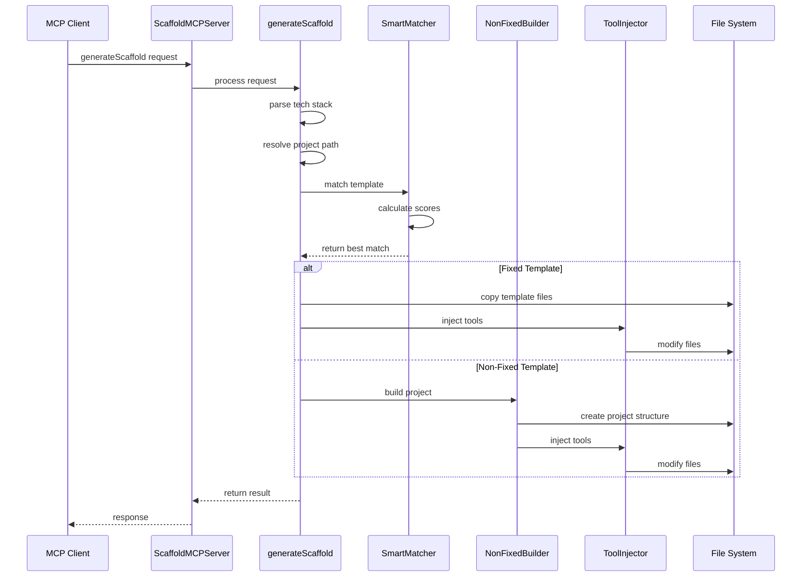
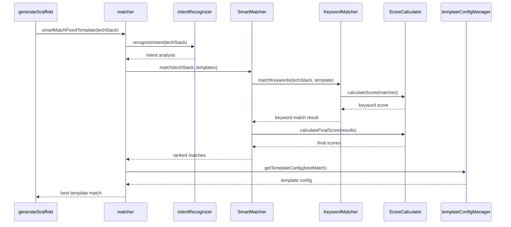
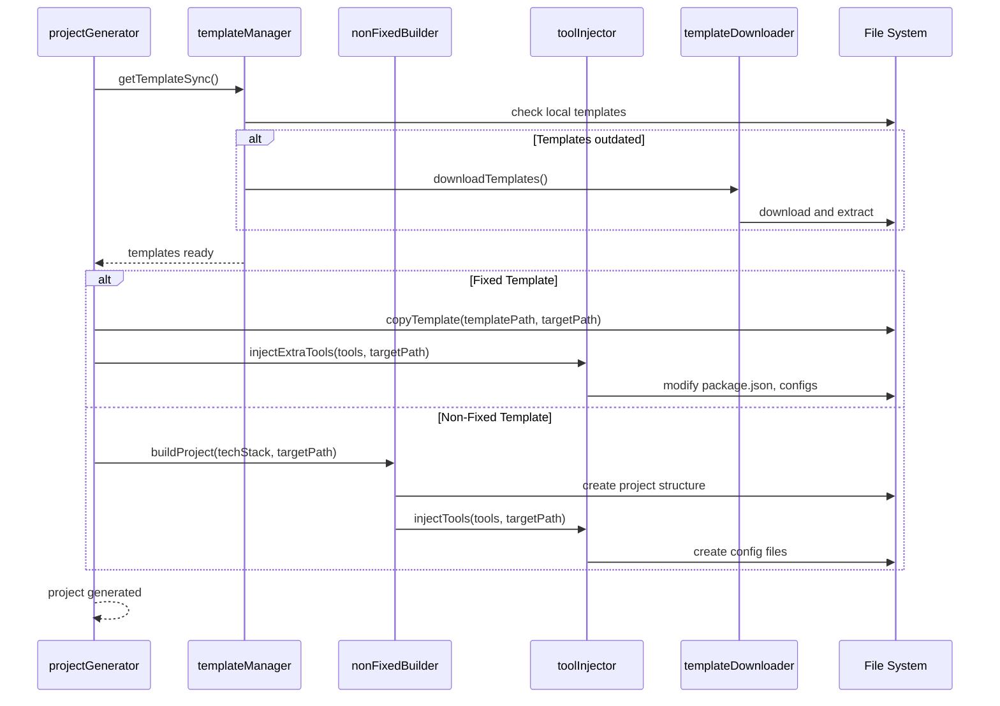
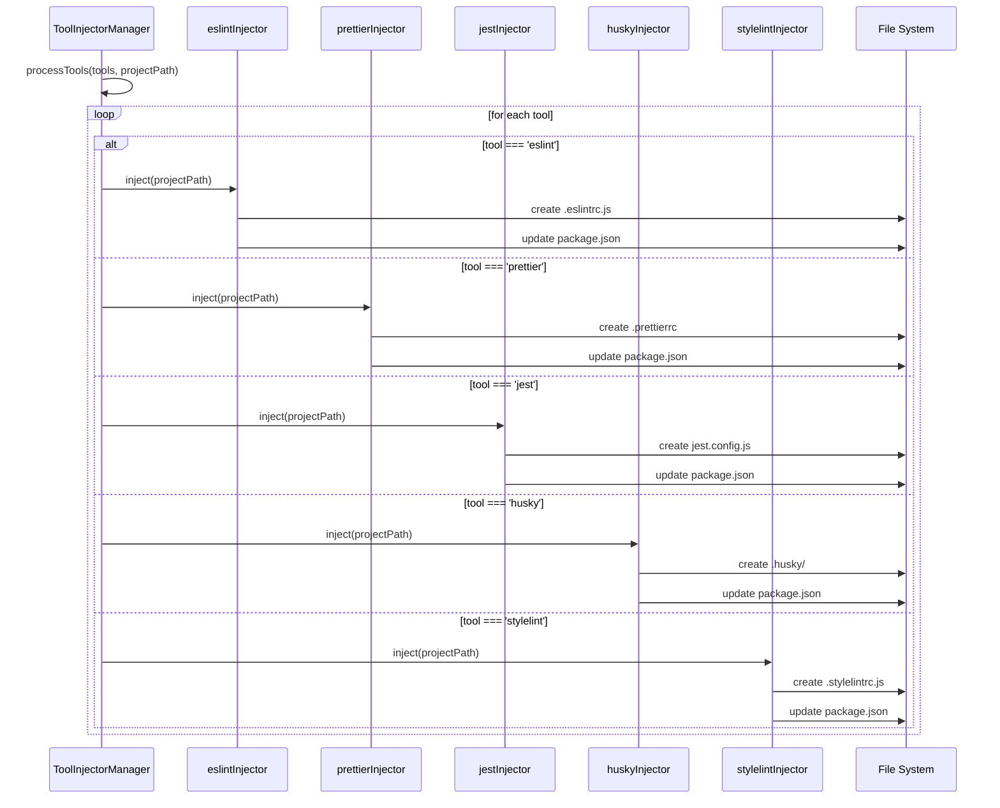
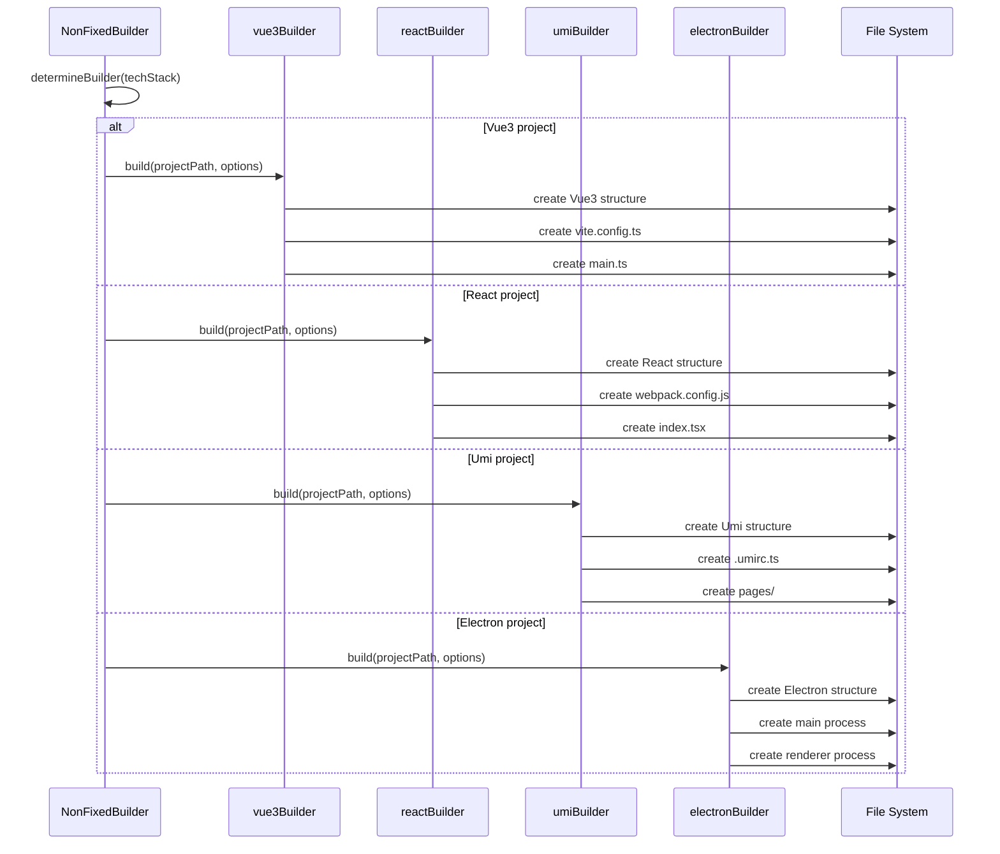
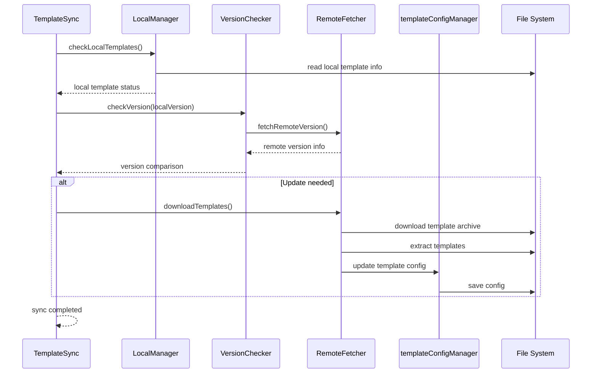
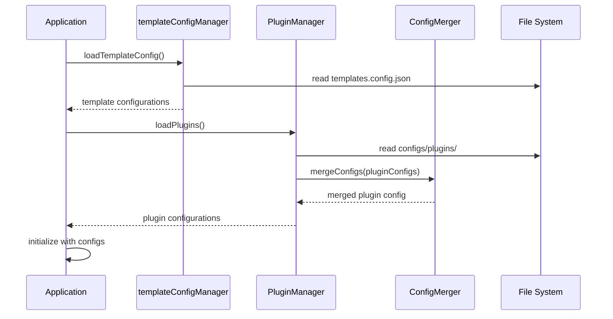
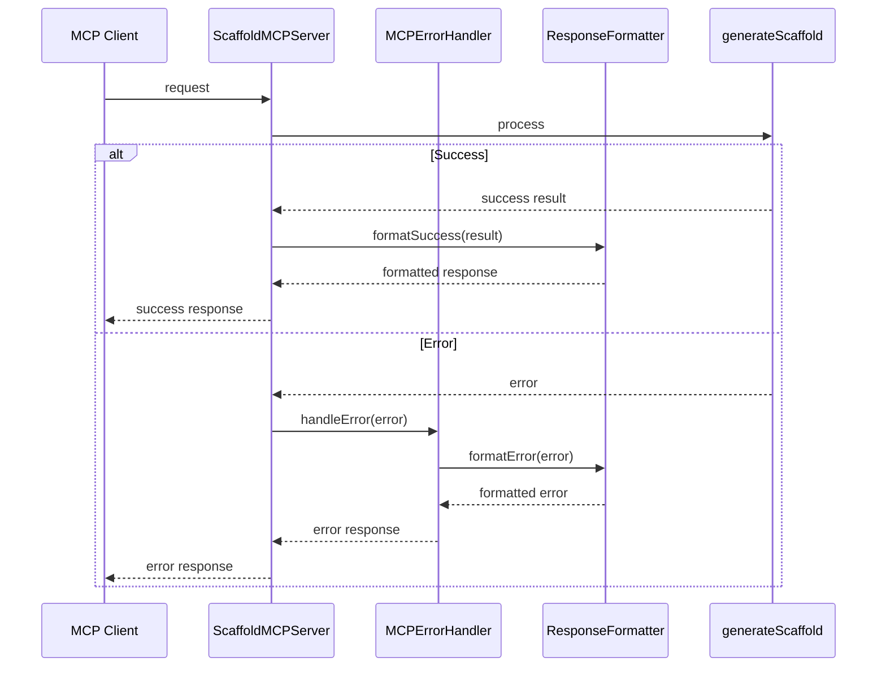
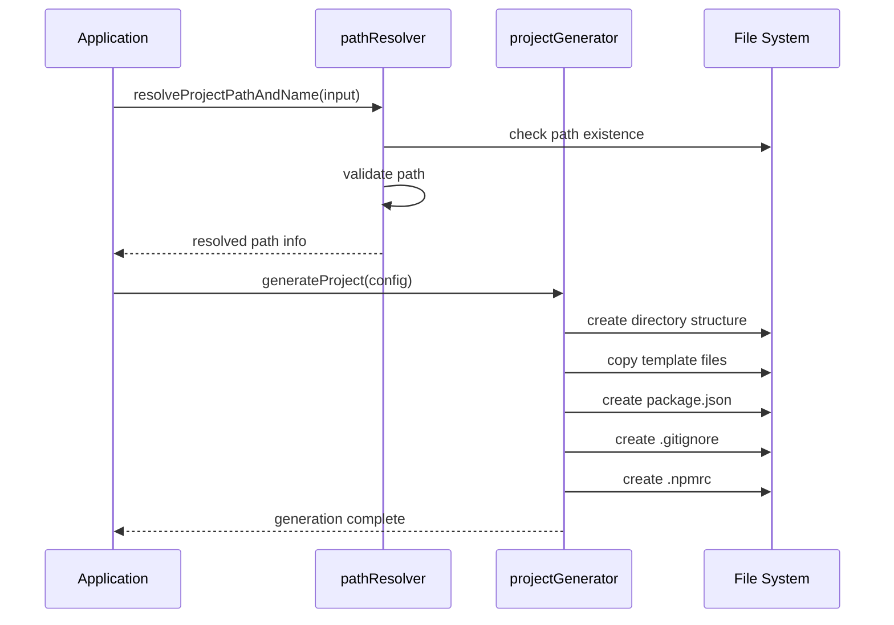
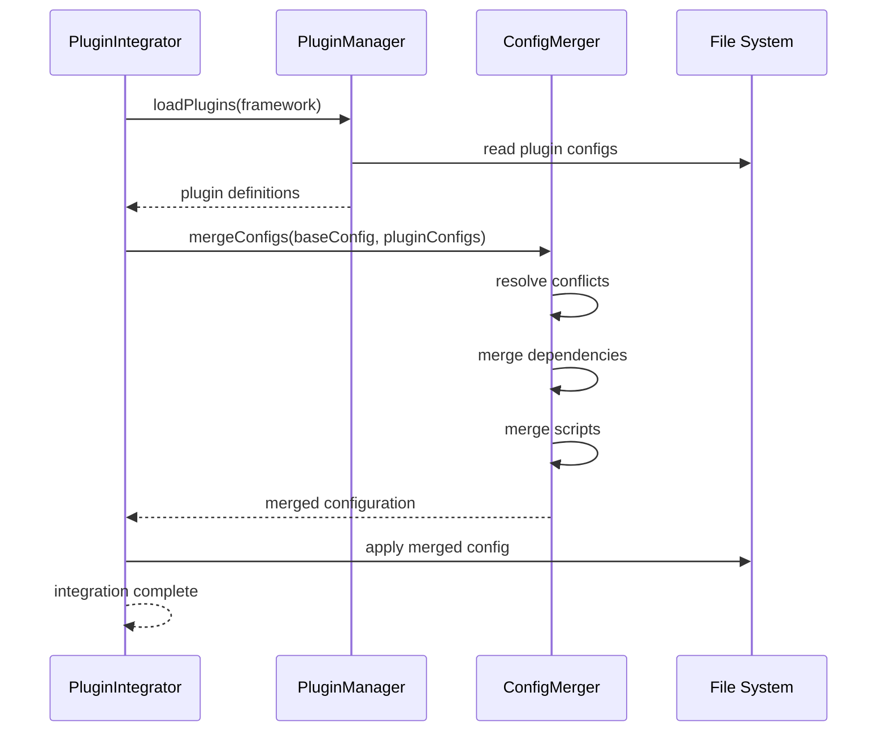

# 模块交互图

## 整体模块交互概览

## 核心模块详细交互

### 模板匹配交互流程

### 项目生成交互流程

### 工具注入交互流程

## 构建器系统交互

### 非固定模板构建交互

## 模板管理系统交互

### 模板同步交互流程

## 配置管理交互

### 配置加载和管理交互

## 错误处理交互

### 错误处理和响应格式化交互

## 文件系统操作交互

### 文件操作交互流程

## 插件系统交互

### 插件集成交互流程

