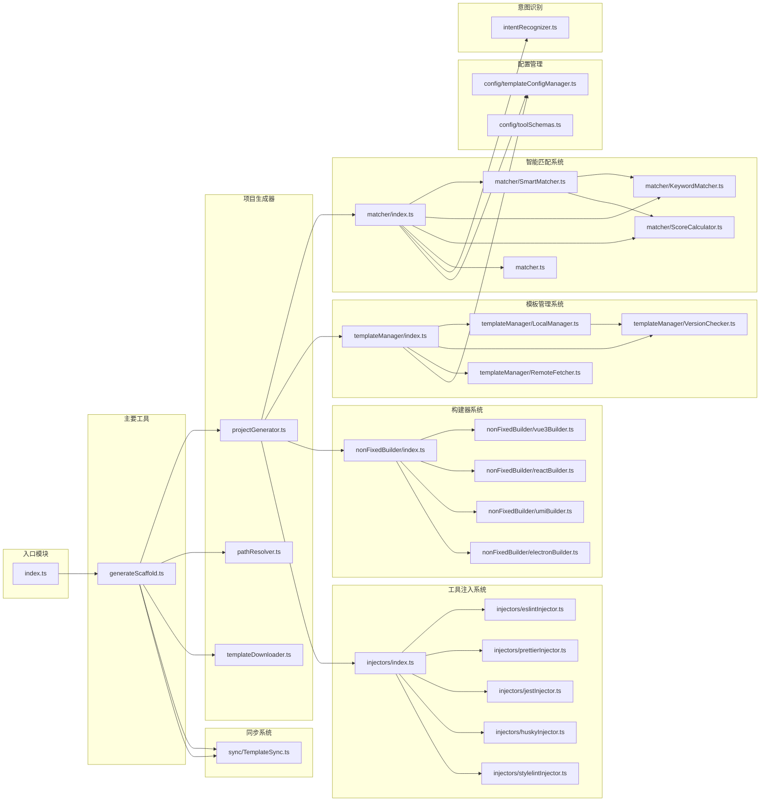
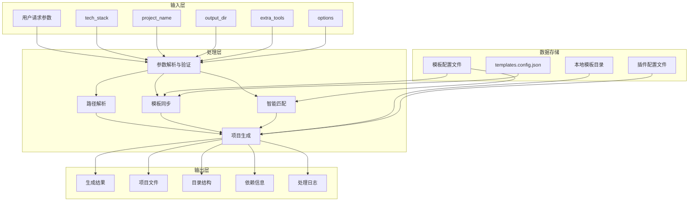
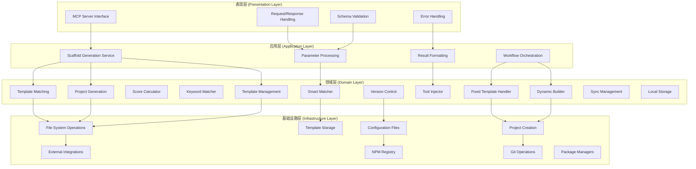
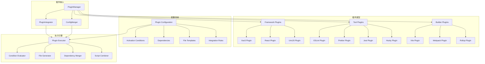

# 项目架构图

## 整体架构概览

```mermaid
graph TB
    subgraph "MCP Server Layer"
        A[index.ts - ScaffoldMCPServer]
        A1[Server - MCP SDK]
        A2[StdioServerTransport]
    end
    
    subgraph "API Layer"
        B[generateScaffold.ts]
        B1[toolSchemas.ts]
    end
    
    subgraph "Core Business Logic"
        C[projectGenerator.ts]
        D[pathResolver.ts]
        E[templateDownloader.ts]
    end
    
    subgraph "Template System"
        F[matcher/SmartMatcher]
        F1[matcher/KeywordMatcher]
        F2[matcher/ScoreCalculator]
        G[templateManager/LocalManager]
        G1[templateManager/VersionChecker]
        G2[templateManager/RemoteFetcher]
    end
    
    subgraph "Builder System"
        H[nonFixedBuilder/index]
        H1[nonFixedBuilder/vue3Builder]
        H2[nonFixedBuilder/reactBuilder]
        H3[nonFixedBuilder/umiBuilder]
        H4[nonFixedBuilder/electronBuilder]
    end
    
    subgraph "Tool Injection System"
        I[injectors/ToolInjectorManager]
        I1[injectors/eslintInjector]
        I2[injectors/prettierInjector]
        I3[injectors/jestInjector]
        I4[injectors/huskyInjector]
        I5[injectors/stylelintInjector]
    end
    
    subgraph "Plugin System"
        J[plugins/PluginManager]
        J1[plugins/PluginIntegrator]
        J2[plugins/ConfigMerger]
    end
    
    subgraph "Configuration"
        K[config/templateConfigManager]
        K1[templates.config.json]
        K2[scaffold-template/]
    end
    
    subgraph "Utilities"
        L[utils/ResponseFormatter]
        M[utils/MCPErrorHandler]
        N[utils/MessageTemplates]
    end
    
    subgraph "Types"
        O[types/index.ts]
        O1[core/plugins/types.ts]
    end
    
    A --> A1
    A --> A2
    A --> B
    A --> B1
    A --> L
    A --> M
    A --> N
    
    B --> C
    B --> D
    B --> E
    B --> O
    
    C --> F
    C --> G
    C --> H
    C --> I
    C --> J
    
    F --> F1
    F --> F2
    F --> K
    
    G --> G1
    G --> G2
    G --> K
    
    H --> H1
    H --> H2
    H --> H3
    H --> H4
    
    I --> I1
    I --> I2
    I --> I3
    I --> I4
    I --> I5
    
    J --> J1
    J --> J2
    
    K --> K1
    K --> K2
    
    O --> O1
```

## 核心模块依赖关系

```mermaid
graph LR
    subgraph "入口模块"
        A[index.ts]
    end
    
    subgraph "主要工具"
        B[generateScaffold.ts]
    end
    
    subgraph "项目生成器"
        C[projectGenerator.ts]
        D[pathResolver.ts]
        E[templateDownloader.ts]
    end
    
    subgraph "智能匹配系统"
        F[matcher/index.ts]
        F1[matcher/SmartMatcher.ts]
        F2[matcher/KeywordMatcher.ts]
        F3[matcher/ScoreCalculator.ts]
        F4[matcher.ts]
    end
    
    subgraph "模板管理系统"
        G[templateManager/index.ts]
        G1[templateManager/LocalManager.ts]
        G2[templateManager/VersionChecker.ts]
        G3[templateManager/RemoteFetcher.ts]
    end
    
    subgraph "构建器系统"
        H[nonFixedBuilder/index.ts]
        H1[nonFixedBuilder/vue3Builder.ts]
        H2[nonFixedBuilder/reactBuilder.ts]
        H3[nonFixedBuilder/umiBuilder.ts]
        H4[nonFixedBuilder/electronBuilder.ts]
    end
    
    subgraph "工具注入系统"
        I[injectors/index.ts]
        I1[injectors/eslintInjector.ts]
        I2[injectors/prettierInjector.ts]
        I3[injectors/jestInjector.ts]
        I4[injectors/huskyInjector.ts]
        I5[injectors/stylelintInjector.ts]
    end
    
    subgraph "配置管理"
        J[config/templateConfigManager.ts]
        J1[config/toolSchemas.ts]
    end
    
    subgraph "同步系统"
        K[sync/TemplateSync.ts]
    end
    
    subgraph "意图识别"
        L[intentRecognizer.ts]
    end
    
    A --> B
    B --> C
    B --> D
    B --> E
    B --> K
    
    C --> F
    C --> G
    C --> H
    C --> I
    
    F --> F1
    F --> F2
    F --> F3
    F --> F4
    F --> L
    
    F1 --> F2
    F1 --> F3
    
    G --> G1
    G --> G2
    G --> G3
    
    G1 --> G2
    
    H --> H1
    H --> H2
    H --> H3
    H --> H4
    
    I --> I1
    I --> I2
    I --> I3
    I --> I4
    I --> I5
    
    F --> J
    G --> J
    
    B --> K
```

## 数据流架构

```mermaid
flowchart TD
    subgraph "输入层"
        A[用户请求参数]
        A1[tech_stack]
        A2[project_name]
        A3[output_dir]
        A4[extra_tools]
        A5[options]
    end
    
    subgraph "处理层"
        B[参数解析与验证]
        C[路径解析]
        D[模板同步]
        E[智能匹配]
        F[项目生成]
    end
    
    subgraph "数据存储"
        G[模板配置文件]
        G1[templates.config.json]
        G2[本地模板目录]
        G3[插件配置文件]
    end
    
    subgraph "输出层"
        H[生成结果]
        H1[项目文件]
        H2[目录结构]
        H3[依赖信息]
        H4[处理日志]
    end
    
    A --> B
    A1 --> B
    A2 --> B
    A3 --> B
    A4 --> B
    A5 --> B
    
    B --> C
    B --> D
    B --> E
    
    C --> F
    D --> F
    E --> F
    
    G --> D
    G --> E
    G1 --> D
    G2 --> F
    G3 --> F
    
    F --> H
    F --> H1
    F --> H2
    F --> H3
    F --> H4
```

## 模块职责分层

```mermaid
graph TB
    subgraph "表现层 (Presentation Layer)"
        A[MCP Server Interface]
        A1[Request/Response Handling]
        A2[Error Handling]
        A3[Schema Validation]
    end
    
    subgraph "应用层 (Application Layer)"
        B[Scaffold Generation Service]
        B1[Parameter Processing]
        B2[Workflow Orchestration]
        B3[Result Formatting]
    end
    
    subgraph "领域层 (Domain Layer)"
        C[Template Matching]
        C1[Smart Matcher]
        C2[Score Calculator]
        C3[Keyword Matcher]
        
        D[Project Generation]
        D1[Fixed Template Handler]
        D2[Dynamic Builder]
        D3[Tool Injector]
        
        E[Template Management]
        E1[Version Control]
        E2[Sync Management]
        E3[Local Storage]
    end
    
    subgraph "基础设施层 (Infrastructure Layer)"
        F[File System Operations]
        F1[Template Storage]
        F2[Project Creation]
        F3[Configuration Files]
        
        G[External Integrations]
        G1[NPM Registry]
        G2[Git Operations]
        G3[Package Managers]
    end
    
    A --> B
    A1 --> B1
    A2 --> B3
    A3 --> B1
    
    B --> C
    B --> D
    B --> E
    B1 --> C1
    B2 --> D1
    B2 --> D2
    B3 --> D3
    
    C --> F
    D --> F
    E --> F
    C1 --> F1
    D1 --> F2
    D2 --> F2
    E1 --> F3
    
    F --> G
    F2 --> G2
    F3 --> G1
```

## 插件系统架构

```mermaid
graph TB
    subgraph "插件核心"
        A[PluginManager]
        B[PluginIntegrator]
        C[ConfigMerger]
    end
    
    subgraph "插件类型"
        D[Framework Plugins]
        D1[Vue3 Plugin]
        D2[React Plugin]
        D3[UmiJS Plugin]
        
        E[Tool Plugins]
        E1[ESLint Plugin]
        E2[Prettier Plugin]
        E3[Jest Plugin]
        E4[Husky Plugin]
        
        F[Builder Plugins]
        F1[Vite Plugin]
        F2[Webpack Plugin]
        F3[Rollup Plugin]
    end
    
    subgraph "配置系统"
        G[Plugin Configuration]
        G1[Activation Conditions]
        G2[Dependencies]
        G3[File Templates]
        G4[Integration Rules]
    end
    
    subgraph "执行引擎"
        H[Plugin Executor]
        H1[Condition Evaluator]
        H2[File Generator]
        H3[Dependency Merger]
        H4[Script Combiner]
    end
    
    A --> B
    A --> C
    B --> H
    C --> H
    
    A --> D
    A --> E
    A --> F
    
    D --> D1
    D --> D2
    D --> D3
    
    E --> E1
    E --> E2
    E --> E3
    E --> E4
    
    F --> F1
    F --> F2
    F --> F3
    
    G --> G1
    G --> G2
    G --> G3
    G --> G4
    
    H --> H1
    H --> H2
    H --> H3
    H --> H4
    
    G --> H
```