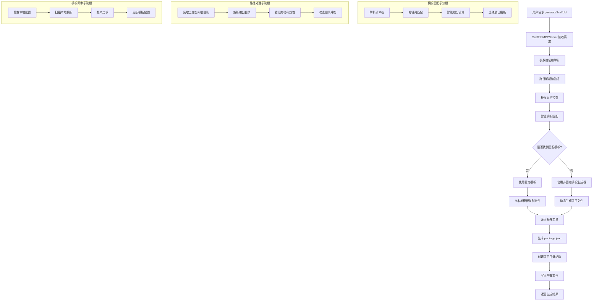
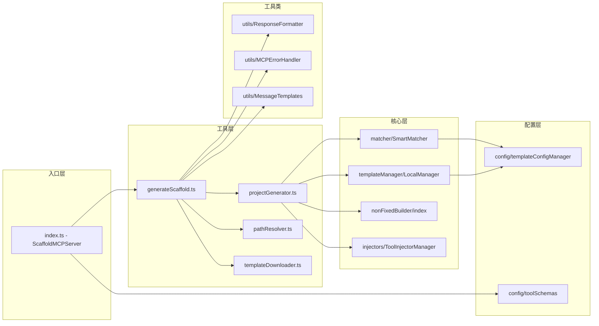
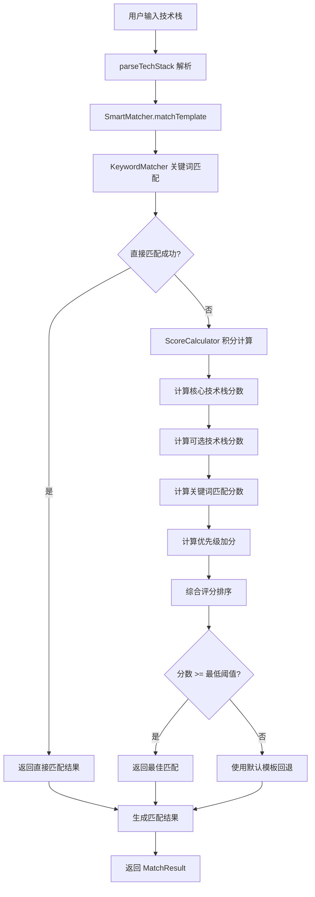
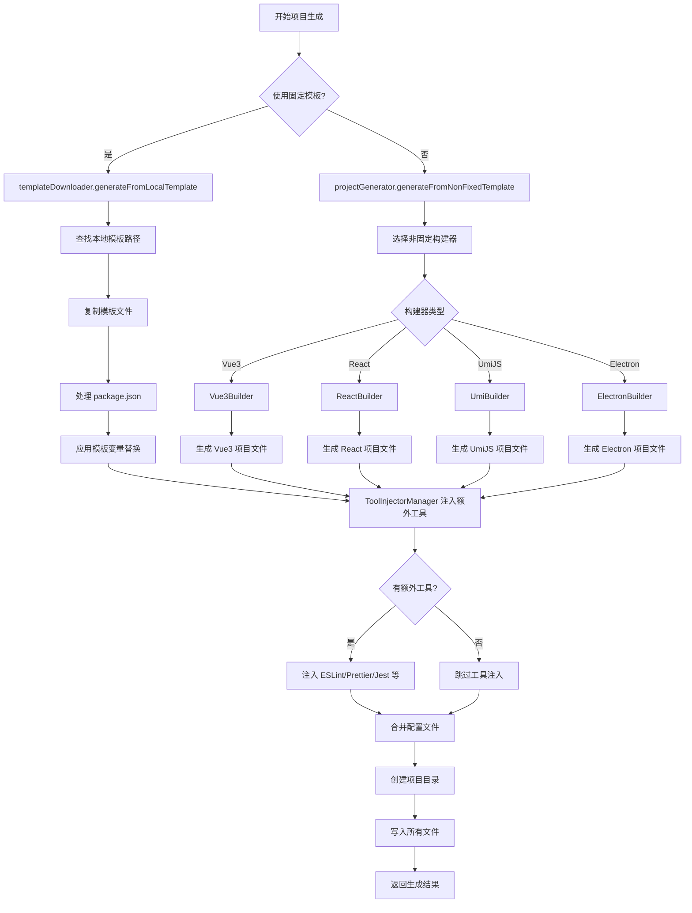

# 项目流程图

## 脚手架生成流程

```mermaid
flowchart TD
    A[用户请求 generateScaffold] --> B[ScaffoldMCPServer 接收请求]
    B --> C[参数验证和解析]
    C --> D[路径解析和验证]
    D --> E[模板同步检查]
    E --> F[智能模板匹配]
    
    F --> G{是否找到匹配模板?}
    G -->|是| H[使用固定模板]
    G -->|否| I[使用非固定模板生成器]
    
    H --> J[从本地模板复制文件]
    I --> K[动态生成项目文件]
    
    J --> L[注入额外工具]
    K --> L
    
    L --> M[生成 package.json]
    M --> N[创建项目目录结构]
    N --> O[写入所有文件]
    O --> P[返回生成结果]
    
    subgraph "模板匹配子流程"
        F1[解析技术栈] --> F2[关键词匹配]
        F2 --> F3[智能积分计算]
        F3 --> F4[选择最佳模板]
    end
    
    subgraph "路径处理子流程"
        D1[获取工作空间根目录] --> D2[解析输出目录]
        D2 --> D3[验证路径有效性]
        D3 --> D4[检查目录冲突]
    end
    
    subgraph "模板同步子流程"
        E1[检查本地配置] --> E2[扫描本地模板]
        E2 --> E3[版本比较]
        E3 --> E4[更新模板配置]
    end
```

## 核心组件交互流程

```mermaid
flowchart LR
    subgraph "入口层"
        A[index.ts - ScaffoldMCPServer]
    end
    
    subgraph "工具层"
        B[generateScaffold.ts]
        C[projectGenerator.ts]
        D[pathResolver.ts]
        E[templateDownloader.ts]
    end
    
    subgraph "核心层"
        F[matcher/SmartMatcher]
        G[templateManager/LocalManager]
        H[nonFixedBuilder/index]
        I[injectors/ToolInjectorManager]
    end
    
    subgraph "配置层"
        J[config/templateConfigManager]
        K[config/toolSchemas]
    end
    
    subgraph "工具类"
        L[utils/ResponseFormatter]
        M[utils/MCPErrorHandler]
        N[utils/MessageTemplates]
    end
    
    A --> B
    B --> C
    B --> D
    B --> E
    
    C --> F
    C --> G
    C --> H
    C --> I
    
    F --> J
    G --> J
    
    B --> L
    B --> M
    B --> N
    
    A --> K
```

## 模板匹配详细流程

```mermaid
flowchart TD
    A[用户输入技术栈] --> B[parseTechStack 解析]
    B --> C[SmartMatcher.matchTemplate]
    
    C --> D[KeywordMatcher 关键词匹配]
    D --> E{直接匹配成功?}
    E -->|是| F[返回直接匹配结果]
    E -->|否| G[ScoreCalculator 积分计算]
    
    G --> H[计算核心技术栈分数]
    H --> I[计算可选技术栈分数]
    I --> J[计算关键词匹配分数]
    J --> K[计算优先级加分]
    K --> L[综合评分排序]
    
    L --> M{分数 >= 最低阈值?}
    M -->|是| N[返回最佳匹配]
    M -->|否| O[使用默认模板回退]
    
    F --> P[生成匹配结果]
    N --> P
    O --> P
    
    P --> Q[返回 MatchResult]
```

## 项目生成详细流程

```mermaid
flowchart TD
    A[开始项目生成] --> B{使用固定模板?}
    
    B -->|是| C[templateDownloader.generateFromLocalTemplate]
    B -->|否| D[projectGenerator.generateFromNonFixedTemplate]
    
    C --> E[查找本地模板路径]
    E --> F[复制模板文件]
    F --> G[处理 package.json]
    G --> H[应用模板变量替换]
    
    D --> I[选择非固定构建器]
    I --> J{构建器类型}
    J -->|Vue3| K[Vue3Builder]
    J -->|React| L[ReactBuilder]
    J -->|UmiJS| M[UmiBuilder]
    J -->|Electron| N[ElectronBuilder]
    
    K --> O[生成 Vue3 项目文件]
    L --> P[生成 React 项目文件]
    M --> Q[生成 UmiJS 项目文件]
    N --> R[生成 Electron 项目文件]
    
    H --> S[ToolInjectorManager 注入额外工具]
    O --> S
    P --> S
    Q --> S
    R --> S
    
    S --> T{有额外工具?}
    T -->|是| U[注入 ESLint/Prettier/Jest 等]
    T -->|否| V[跳过工具注入]
    
    U --> W[合并配置文件]
    V --> W
    W --> X[创建项目目录]
    X --> Y[写入所有文件]
    Y --> Z[返回生成结果]
```