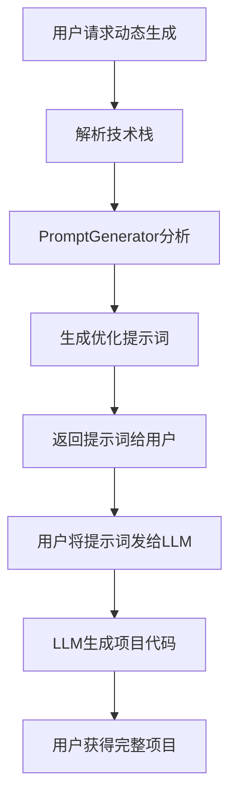

```chatReference::memory
[{"id":"6f5a2e60-7722-41f2-950c-765a10cc7882","title":"脚手架项目生成问题诊断与修复"},{"id":"94f16ff0-2f4e-4f92-afc1-216f119ab620","title":"脚手架生成相关文件"},{"id":"085c22b0-78f5-43b1-95e8-a6eaad4c0510","title":"脚手架生成相关文件"},{"id":"1ddfe008-c8a2-40cd-936b-4e611b071caf","title":"动态生成器职责简化"},{"id":"f87fa8b8-5dbe-4c34-b6a2-2339ea30f8c8","title":"注入器缺失导致模板生成错误"},{"id":"a8cfe1de-67b6-410f-b508-119adc32a979","title":"混合市场方案设计"},{"id":"97f884c4-e4d2-4430-969f-5c0341ddbb13","title":"模板市场设计模式"}]
```

我理解您的需求。让我先分析当前的动态模板实现，然后输出技术方案。

```toolCall::search_symbol
```


```toolCall::read_file
```


```toolCall::read_file
```

基于您的需求和当前代码结构分析,我现在输出技术方案:

## 🎯 动态模板生成优化方案 - 提示词驱动模式

### 一、问题分析

**当前问题:**
- 动态模板技术栈匹配不准确,经常出错
- `dynamicGenerator.ts` 通过代码逻辑生成项目,存在兼容性问题
- 注入器系统复杂度高,维护成本大

**解决思路:**
- 不再由系统自动生成动态模板
- 改为生成优化的提示词,交给大语言模型自主构建
- 利用LLM的理解能力和灵活性,避免硬编码逻辑

---

### 二、核心设计方案

#### 1. **提示词生成器 (PromptGenerator)**

创建新模块: `src/tools/promptGenerator.ts`

**功能职责:**
- 分析用户技术栈需求
- 生成结构化的提示词
- 包含项目上下文、技术栈、文件结构建议

**提示词模板结构:**
```typescript
interface PromptTemplate {
  // 项目基础信息
  projectContext: {
    name: string;
    techStack: TechStack;
    extraTools: string[];
  };
  
  // 文件结构建议
  suggestedStructure: {
    directories: string[];
    coreFiles: string[];
  };
  
  // 技术栈配置建议
  configurationHints: {
    buildTool: string;
    dependencies: string[];
    devDependencies: string[];
  };
  
  // 最佳实践提示
  bestPractices: string[];
  
  // 格式化的提示词
  formattedPrompt: string;
}
```

#### 2. **提示词优化策略**

**分层提示词生成:**

```
📋 基础层 - 项目元信息
├─ 项目名称
├─ 技术栈配置
└─ 开发语言

🏗️ 架构层 - 目录结构建议
├─ src/ (源代码)
├─ public/ (静态资源)
├─ config/ (配置文件)
└─ tests/ (测试文件)

⚙️ 配置层 - 工具链配置
├─ package.json 依赖
├─ 构建工具配置
├─ 代码规范配置
└─ TypeScript/Babel配置

✨ 最佳实践层
├─ 代码组织规范
├─ 文件命名约定
└─ 常用工具集成
```

#### 3. **集成点改造**

**修改点 1: `generateScaffold.ts`**
```typescript
// 原代码(第333行附近):
const unifiedResult = await unifiedGenerator.generateWithDynamicTemplate(
  toolInput,
  { projectName, outputDir, preview, force }
);

// 改造后:
const promptGenerator = new PromptGenerator();
const optimizedPrompt = await promptGenerator.generate({
  projectName,
  techStack,
  extraTools: params.extra_tools || [],
  outputDir
});

// 返回提示词给用户
return {
  success: true,
  message: "已生成优化提示词,请使用以下提示词让LLM构建项目",
  optimizedPrompt: optimizedPrompt.formattedPrompt,
  metadata: optimizedPrompt.projectContext,
  processLogs
};
```

**修改点 2: `UnifiedProjectGenerator.ts`**
```typescript
// 新增方法:
async generatePromptForDynamic(
  toolInput: UnifiedToolInput,
  options: UnifiedGenerateOptions = {}
): Promise<PromptGenerationResult> {
  // 解析工具集
  const toolSet = this.toolParser.parse(toolInput);
  
  // 生成优化提示词
  const promptGenerator = new PromptGenerator();
  return await promptGenerator.generate({
    toolSet,
    projectName: options.projectName,
    techStack: this.convertToTechStack(toolSet)
  });
}
```

#### 4. **提示词模板示例**

```typescript
const DYNAMIC_TEMPLATE = `
# 🚀 项目脚手架生成提示词

## 📋 项目信息
- **项目名称**: {{projectName}}
- **开发语言**: {{language}}
- **框架**: {{framework}}
- **构建工具**: {{buildTool}}

## 🏗️ 目录结构
请创建以下目录结构:
\`\`\`
{{projectName}}/
├── src/
│   ├── components/
│   ├── utils/
│   ├── styles/
│   └── main.{{fileExt}}
├── public/
│   └── index.html
├── config/
│   └── {{buildTool}}.config.{{configExt}}
├── package.json
├── tsconfig.json (如果使用TypeScript)
└── README.md
\`\`\`

## 📦 依赖配置
### dependencies:
{{#each dependencies}}
- {{this}}
{{/each}}

### devDependencies:
{{#each devDependencies}}
- {{this}}
{{/each}}

## ⚙️ 配置文件

### package.json
\`\`\`json
{
  "name": "{{projectName}}",
  "version": "1.0.0",
  "scripts": {
    {{scripts}}
  }
}
\`\`\`

### {{buildTool}}.config
{{buildToolConfig}}

## ✨ 最佳实践建议
{{#each bestPractices}}
- {{this}}
{{/each}}

## 🎯 核心文件生成要求
1. 创建入口文件 (main.{{fileExt}})
2. 配置路由 (如需要)
3. 集成UI库 ({{uiLibrary}})
4. 配置状态管理 ({{stateManagement}})

请根据以上信息生成完整的项目脚手架。
`;
```

---

### 三、实现步骤

#### **阶段1: 核心模块开发** (1-2天)
1. ✅ 创建 `PromptGenerator` 类
2. ✅ 实现技术栈分析逻辑
3. ✅ 设计提示词模板引擎
4. ✅ 添加依赖推荐系统

#### **阶段2: 集成改造** (1天)
1. ✅ 修改 `generateScaffold.ts` 动态分支
2. ✅ 修改 `UnifiedProjectGenerator.ts`
3. ✅ 移除 `dynamicGenerator.ts` 的调用
4. ✅ 保留注入器系统(用于固定模板)

#### **阶段3: 测试优化** (1天)
1. ✅ 编写单元测试
2. ✅ 端到端测试
3. ✅ 提示词质量验证
4. ✅ 文档更新

---

### 四、技术优势

| 维度 | 当前方案 | 新方案 |
|------|---------|--------|
| **灵活性** | 硬编码逻辑,难以适配 | LLM自主理解,灵活适配 |
| **准确性** | 匹配算法易出错 | 自然语言理解,更准确 |
| **维护成本** | 需维护复杂注入器 | 仅维护提示词模板 |
| **扩展性** | 需开发新注入器 | 修改模板即可 |
| **用户体验** | 黑盒生成,不透明 | 提示词可审查,可调整 |

---

### 五、向后兼容

**保留内容:**
- ✅ 固定模板匹配机制(SmartMatcher)
- ✅ 统一注入系统(用于固定模板)
- ✅ 模板同步机制

**移除内容:**
- ❌ [generateFromNonFixedTemplate](file:///Users/zcg/Desktop/scafford-mcp-server-AI/trae/scaffold-mcp-server/src/tools/projectGenerator.ts#L175-L184) 函数
- ❌ 动态模板的注入器调用
- ❌ 复杂的工具解析逻辑

**新增内容:**
- ➕ `PromptGenerator` 提示词生成器
- ➕ 提示词模板库
- ➕ 依赖推荐系统

---

### 六、返回结果格式

```typescript
interface DynamicGenerationResult {
  success: true;
  mode: "prompt-driven";
  optimizedPrompt: string;  // 优化后的提示词
  metadata: {
    projectName: string;
    techStack: TechStack;
    suggestedDependencies: string[];
    suggestedStructure: DirectoryStructure;
  };
  instructions: string;  // 使用说明
  processLogs: string[];
}
```

---

### 七、示例流程



---

### 八、风险控制

**风险点:**
1. 提示词质量不稳定
2. LLM输出格式不可控
3. 用户需要二次操作

**缓解措施:**
1. 建立提示词测试集,持续优化
2. 提供标准化的输出格式要求
3. 提供一键复制功能,降低操作成本

---

## 🎯 总结

这个方案的核心思想是:**将复杂的代码生成逻辑转化为结构化的提示词,充分利用大语言模型的理解和生成能力**。

**关键优势:**
- 🚀 降低系统复杂度
- 🎯 提高生成准确性  
- 🔧 简化维护成本
- 💡 增强用户透明度

请确认这个方案是否符合您的预期,我将立即开始实现!