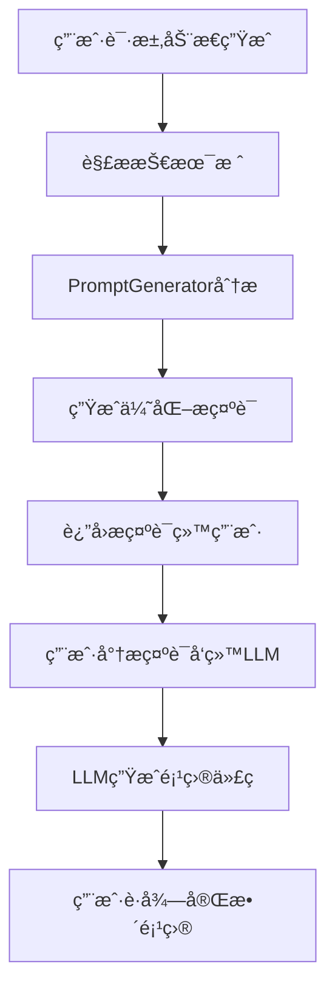

```chatReference::memory
[{"id":"6f5a2e60-7722-41f2-950c-765a10cc7882","title":"脚手æ¶é¡¹ç›®ç”Ÿæˆé—®é¢˜è¯Šæ–­ä¸ä¿®å¤"},{"id":"94f16ff0-2f4e-4f92-afc1-216f119ab620","title":"脚手æ¶ç”Ÿæˆç›¸å…³æ–‡ä»¶"},{"id":"085c22b0-78f5-43b1-95e8-a6eaad4c0510","title":"脚手æ¶ç”Ÿæˆç›¸å…³æ–‡ä»¶"},{"id":"1ddfe008-c8a2-40cd-936b-4e611b071caf","title":"动æ€ç”Ÿæˆå™¨èŒè´£ç®€åŒ–"},{"id":"f87fa8b8-5dbe-4c34-b6a2-2339ea30f8c8","title":"注入器缺失导致模æ¿ç”Ÿæˆé”™è¯¯"},{"id":"a8cfe1de-67b6-410f-b508-119adc32a979","title":"æ··åˆå¸‚场方案设计"},{"id":"97f884c4-e4d2-4430-969f-5c0341ddbb13","title":"模æ¿å¸‚场设计模å¼"}]
```

我ç†è§£æ‚¨çš„需求。让我先分æ当å‰çš„动æ€æ¨¡æ¿å®ç°ï¼Œç„¶å输出技术方案。

```toolCall::search_symbol
```


```toolCall::read_file
```


```toolCall::read_file
```

基äºæ‚¨çš„需求和当å‰ä»£ç ç»“æ„分æ,我ç°åœ¨è¾“出技术方案:

## 🯠动æ€æ¨¡æ¿ç”Ÿæˆä¼˜åŒ–方案 - æ示è¯é©±åŠ¨æ¨¡å¼

### 一ã€é—®é¢˜åˆ†æ

**当å‰é—®é¢˜:**
- 动æ€æ¨¡æ¿æŠ€æœ¯æ ˆåŒ¹é…ä¸å‡†ç¡®,ç»å¸¸å‡ºé”™
- `dynamicGenerator.ts` 通过代ç é€»è¾‘生æˆé¡¹ç›®,存在兼容性问题
- 注入器系统å¤æ‚度高,维护æˆæœ¬å¤§

**解决æ€è·¯:**
- ä¸å†ç”±ç³»ç»Ÿè‡ªåŠ¨ç”ŸæˆåŠ¨æ€æ¨¡æ¿
- 改为生æˆä¼˜åŒ–çš„æ示è¯,交给大语言模å‹è‡ªä¸»æ„建
- 利用LLMçš„ç†è§£èƒ½åŠ›å’Œçµæ´»æ€§,é¿å…硬编ç é€»è¾‘

---

### 二ã€æ ¸å¿ƒè®¾è®¡æ–¹æ¡ˆ

#### 1. **æ示è¯ç”Ÿæˆå™¨ (PromptGenerator)**

创建新模å—: `src/tools/promptGenerator.ts`

**功能èŒè´£:**
- 分æ用户技术栈需求
- 生æˆç»“æ„化的æ示è¯
- 包å«é¡¹ç›®ä¸Šä¸‹æ–‡ã€æŠ€æœ¯æ ˆã€æ–‡ä»¶ç»“æ„建议

**æ示è¯æ¨¡æ¿ç»“æ„:**
```typescript
interface PromptTemplate {
  // 项目基础信æ¯
  projectContext: {
    name: string;
    techStack: TechStack;
    extraTools: string[];
  };
  
  // 文件结æ„建议
  suggestedStructure: {
    directories: string[];
    coreFiles: string[];
  };
  
  // 技术栈é…置建议
  configurationHints: {
    buildTool: string;
    dependencies: string[];
    devDependencies: string[];
  };
  
  // 最佳å®è·µæ示
  bestPractices: string[];
  
  // æ ¼å¼åŒ–çš„æ示è¯
  formattedPrompt: string;
}
```

#### 2. **æ示è¯ä¼˜åŒ–ç­–ç•¥**

**分层æ示è¯ç”Ÿæˆ:**

```
📋 基础层 - 项目元信æ¯
├─ 项目å称
├─ 技术栈é…ç½®
└─ å¼€å‘语言

ğŸ—ï¸ æ¶æ„层 - 目录结æ„建议
├─ src/ (æºä»£ç )
├─ public/ (é™æ€èµ„æº)
├─ config/ (é…置文件)
└─ tests/ (测试文件)

âš™ï¸ é…置层 - 工具链é…ç½®
├─ package.json ä¾èµ–
├─ æ„建工具é…ç½®
├─ 代ç è§„范é…ç½®
└─ TypeScript/Babelé…ç½®

✨ 最佳å®è·µå±‚
├─ 代ç ç»„织规范
├─ 文件命å约定
└─ 常用工具集æˆ
```

#### 3. **集æˆç‚¹æ”¹é€ **

**修改点 1: `generateScaffold.ts`**
```typescript
// åŸä»£ç (第333行附近):
const unifiedResult = await unifiedGenerator.generateWithDynamicTemplate(
  toolInput,
  { projectName, outputDir, preview, force }
);

// 改造å:
const promptGenerator = new PromptGenerator();
const optimizedPrompt = await promptGenerator.generate({
  projectName,
  techStack,
  extraTools: params.extra_tools || [],
  outputDir
});

// è¿”å›æ示è¯ç»™ç”¨æˆ·
return {
  success: true,
  message: "已生æˆä¼˜åŒ–æ示è¯,请使用以下æ示è¯è®©LLMæ„建项目",
  optimizedPrompt: optimizedPrompt.formattedPrompt,
  metadata: optimizedPrompt.projectContext,
  processLogs
};
```

**修改点 2: `UnifiedProjectGenerator.ts`**
```typescript
// æ–°å¢æ–¹æ³•:
async generatePromptForDynamic(
  toolInput: UnifiedToolInput,
  options: UnifiedGenerateOptions = {}
): Promise<PromptGenerationResult> {
  // 解æ工具集
  const toolSet = this.toolParser.parse(toolInput);
  
  // 生æˆä¼˜åŒ–æ示è¯
  const promptGenerator = new PromptGenerator();
  return await promptGenerator.generate({
    toolSet,
    projectName: options.projectName,
    techStack: this.convertToTechStack(toolSet)
  });
}
```

#### 4. **æ示è¯æ¨¡æ¿ç¤ºä¾‹**

```typescript
const DYNAMIC_TEMPLATE = `
# 🚀 项目脚手æ¶ç”Ÿæˆæ示è¯

## 📋 项目信æ¯
- **项目å称**: {{projectName}}
- **å¼€å‘语言**: {{language}}
- **框æ¶**: {{framework}}
- **æ„建工具**: {{buildTool}}

## ğŸ—ï¸ ç›®å½•ç»“æ„
请创建以下目录结æ„:
\`\`\`
{{projectName}}/
├── src/
│   ├── components/
│   ├── utils/
│   ├── styles/
│   └── main.{{fileExt}}
├── public/
│   └── index.html
├── config/
│   └── {{buildTool}}.config.{{configExt}}
├── package.json
├── tsconfig.json (如æœä½¿ç”¨TypeScript)
└── README.md
\`\`\`

## 📦 ä¾èµ–é…ç½®
### dependencies:
{{#each dependencies}}
- {{this}}
{{/each}}

### devDependencies:
{{#each devDependencies}}
- {{this}}
{{/each}}

## âš™ï¸ é…置文件

### package.json
\`\`\`json
{
  "name": "{{projectName}}",
  "version": "1.0.0",
  "scripts": {
    {{scripts}}
  }
}
\`\`\`

### {{buildTool}}.config
{{buildToolConfig}}

## ✨ 最佳å®è·µå»ºè®®
{{#each bestPractices}}
- {{this}}
{{/each}}

## 🯠核心文件生æˆè¦æ±‚
1. 创建入å£æ–‡ä»¶ (main.{{fileExt}})
2. é…置路由 (如需è¦)
3. 集æˆUI库 ({{uiLibrary}})
4. é…置状æ€ç®¡ç† ({{stateManagement}})

请根æ®ä»¥ä¸Šä¿¡æ¯ç”Ÿæˆå®Œæ•´çš„项目脚手æ¶ã€‚
`;
```

---

### 三ã€å®ç°æ­¥éª¤

#### **阶段1: 核心模å—å¼€å‘** (1-2天)
1. ✅ 创建 `PromptGenerator` 类
2. ✅ å®ç°æŠ€æœ¯æ ˆåˆ†æ逻辑
3. ✅ 设计æ示è¯æ¨¡æ¿å¼•æ“
4. ✅ 添加ä¾èµ–æ¨è系统

#### **阶段2: 集æˆæ”¹é€ ** (1天)
1. ✅ 修改 `generateScaffold.ts` 动æ€åˆ†æ”¯
2. ✅ 修改 `UnifiedProjectGenerator.ts`
3. ✅ 移除 `dynamicGenerator.ts` 的调用
4. ✅ ä¿ç•™æ³¨å…¥å™¨ç³»ç»Ÿ(用äºå›ºå®šæ¨¡æ¿)

#### **阶段3: 测试优化** (1天)
1. ✅ 编写å•å…ƒæµ‹è¯•
2. ✅ 端到端测试
3. ✅ æ示è¯è´¨é‡éªŒè¯
4. ✅ 文档更新

---

### å››ã€æŠ€æœ¯ä¼˜åŠ¿

| 维度 | 当å‰æ–¹æ¡ˆ | 新方案 |
|------|---------|--------|
| **çµæ´»æ€§** | 硬编ç é€»è¾‘,éš¾ä»¥é€‚é… | LLM自主ç†è§£,çµæ´»é€‚é… |
| **准确性** | 匹é…算法易出错 | 自然语言ç†è§£,更准确 |
| **维护æˆæœ¬** | 需维护å¤æ‚注入器 | 仅维护æ示è¯æ¨¡æ¿ |
| **扩展性** | 需开å‘新注入器 | 修改模æ¿å³å¯ |
| **用户体验** | 黑盒生æˆ,ä¸é€æ˜ | æ示è¯å¯å®¡æŸ¥,å¯è°ƒæ•´ |

---

### 五ã€å‘å兼容

**ä¿ç•™å†…容:**
- ✅ 固定模æ¿åŒ¹é…机制(SmartMatcher)
- ✅ 统一注入系统(用äºå›ºå®šæ¨¡æ¿)
- ✅ 模æ¿åŒæ­¥æœºåˆ¶

**移除内容:**
- ⌠[generateFromNonFixedTemplate](file:///Users/zcg/Desktop/scafford-mcp-server-AI/trae/scaffold-mcp-server/src/tools/projectGenerator.ts#L175-L184) 函数
- ⌠动æ€æ¨¡æ¿çš„注入器调用
- ⌠å¤æ‚的工具解æ逻辑

**æ–°å¢å†…容:**
- â• `PromptGenerator` æ示è¯ç”Ÿæˆå™¨
- â• æ示è¯æ¨¡æ¿åº“
- â• ä¾èµ–æ¨è系统

---

### å…­ã€è¿”å›ç»“æœæ ¼å¼

```typescript
interface DynamicGenerationResult {
  success: true;
  mode: "prompt-driven";
  optimizedPrompt: string;  // 优化åçš„æ示è¯
  metadata: {
    projectName: string;
    techStack: TechStack;
    suggestedDependencies: string[];
    suggestedStructure: DirectoryStructure;
  };
  instructions: string;  // 使用说æ˜
  processLogs: string[];
}
```

---

### 七ã€ç¤ºä¾‹æµç¨‹



---

### å…«ã€é£é™©æ§åˆ¶

**é£é™©ç‚¹:**
1. æ示è¯è´¨é‡ä¸ç¨³å®š
2. LLM输出格å¼ä¸å¯æ§
3. 用户需è¦äºŒæ¬¡æ“作

**缓解æªæ–½:**
1. 建立æ示è¯æµ‹è¯•é›†,æŒç»­ä¼˜åŒ–
2. æ供标准化的输出格å¼è¦æ±‚
3. æ供一键å¤åˆ¶åŠŸèƒ½,é™ä½æ“作æˆæœ¬

---

## 🯠总结

这个方案的核心æ€æƒ³æ˜¯:**å°†å¤æ‚的代ç ç”Ÿæˆé€»è¾‘转化为结æ„化的æ示è¯,充分利用大语言模å‹çš„ç†è§£å’Œç”Ÿæˆèƒ½åŠ›**。

**关键优势:**
- 🚀 é™ä½ç³»ç»Ÿå¤æ‚度
- 🯠æ高生æˆå‡†ç¡®æ€§  
- 🔧 简化维护æˆæœ¬
- 💡 å¢å¼ºç”¨æˆ·é€æ˜åº¦

请确认这个方案是å¦ç¬¦åˆæ‚¨çš„预期,我将立å³å¼€å§‹å®ç°!