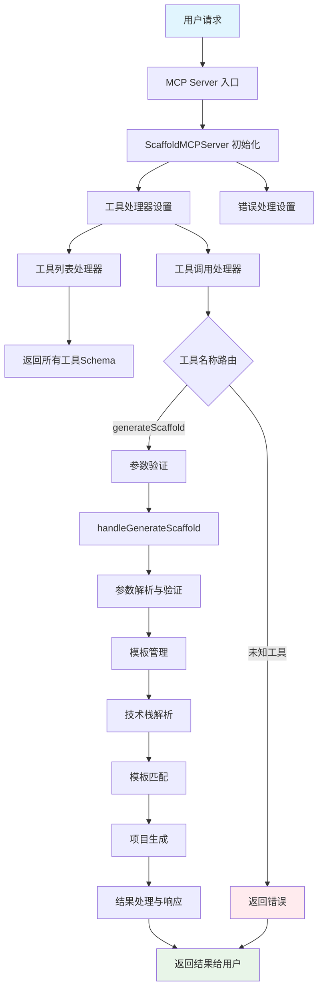
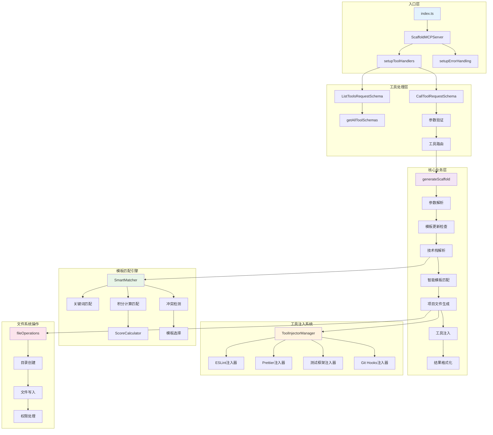
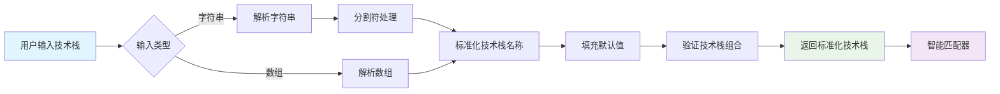
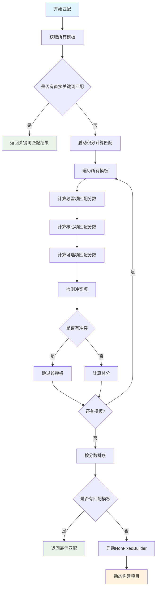
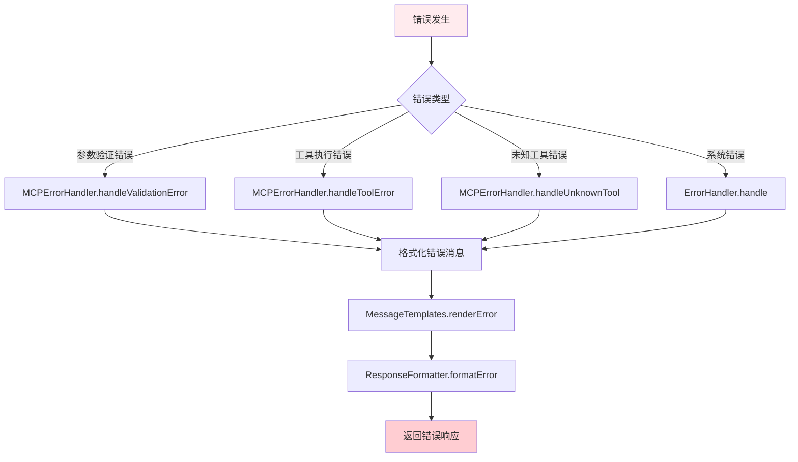
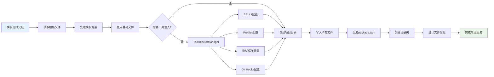
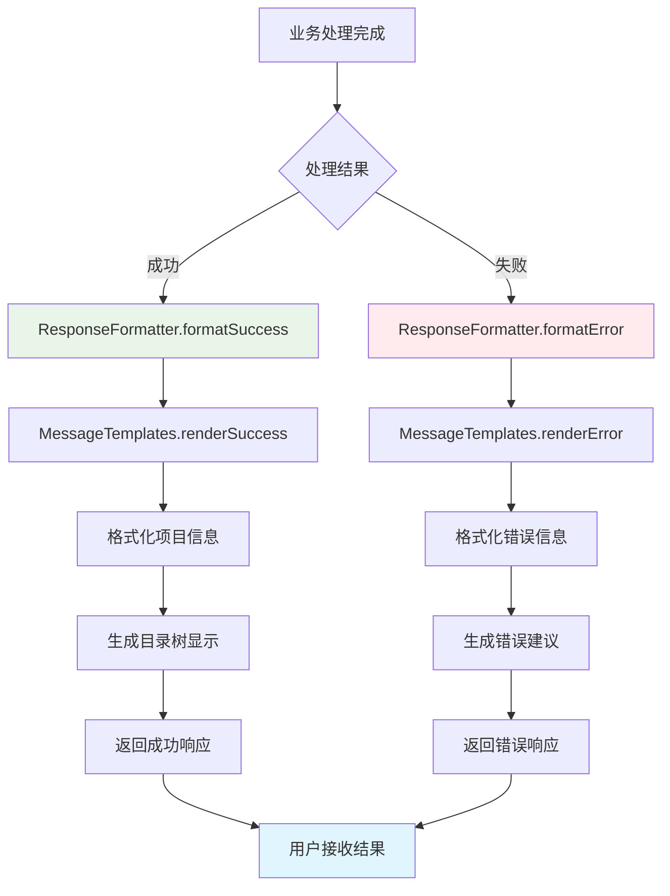
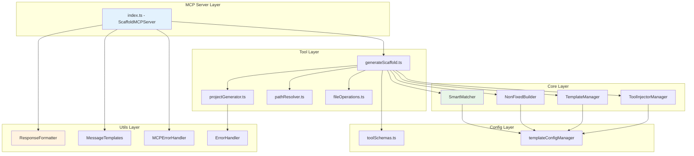

# Scaffold MCP Server 系统流程图 (Mermaid)

## 主要系统流程图

```mermaid
flowchart TD
    A[用户请求] --> B[MCP Server 入口]
    B --> C[ScaffoldMCPServer 初始化]
    
    C --> D[工具处理器设置]
    C --> E[错误处理设置]
    
    D --> F[工具列表处理器]
    D --> G[工具调用处理器]
    
    F --> H[返回所有工具Schema]
    
    G --> I{工具名称路由}
    I -->|generateScaffold| J[参数验证]
    I -->|未知工具| K[返回错误]
    
    J --> L[handleGenerateScaffold]
    
    L --> M[参数解析与验证]
    M --> N[模板管理]
    N --> O[技术栈解析]
    O --> P[模板匹配]
    P --> Q[项目生成]
    Q --> R[结果处理与响应]
    
    R --> S[返回结果给用户]
    K --> S
    
    style A fill:#e1f5fe
    style S fill:#e8f5e8
    style K fill:#ffebee
```

## 详细业务流程图

```mermaid
flowchart TD
    subgraph "入口层"
        A1[index.ts] --> A2[ScaffoldMCPServer]
        A2 --> A3[setupToolHandlers]
        A2 --> A4[setupErrorHandling]
    end
    
    subgraph "工具处理层"
        B1[ListToolsRequestSchema] --> B2[getAllToolSchemas]
        B3[CallToolRequestSchema] --> B4[参数验证]
        B4 --> B5[工具路由]
    end
    
    subgraph "核心业务层"
        C1[generateScaffold] --> C2[参数解析]
        C2 --> C3[模板更新检查]
        C3 --> C4[技术栈解析]
        C4 --> C5[智能模板匹配]
        C5 --> C6[项目文件生成]
        C6 --> C7[工具注入]
        C7 --> C8[结果格式化]
    end
    
    subgraph "模板匹配引擎"
        D1[SmartMatcher] --> D2[关键词匹配]
        D1 --> D3[积分计算匹配]
        D3 --> D4[ScoreCalculator]
        D1 --> D5[冲突检测]
        D5 --> D6[模板选择]
    end
    
    subgraph "工具注入系统"
        E1[ToolInjectorManager] --> E2[ESLint注入器]
        E1 --> E3[Prettier注入器]
        E1 --> E4[测试框架注入器]
        E1 --> E5[Git Hooks注入器]
    end
    
    subgraph "文件系统操作"
        F1[fileOperations] --> F2[目录创建]
        F2 --> F3[文件写入]
        F3 --> F4[权限处理]
    end
    
    A3 --> B1
    A3 --> B3
    B5 --> C1
    C4 --> D1
    C6 --> E1
    C6 --> F1
    
    style A1 fill:#e3f2fd
    style C1 fill:#f3e5f5
    style D1 fill:#e8f5e8
    style E1 fill:#fff3e0
    style F1 fill:#fce4ec
```

## 技术栈解析流程图

```mermaid
flowchart LR
    A[用户输入技术栈] --> B{输入类型}
    
    B -->|字符串| C[解析字符串]
    B -->|数组| D[解析数组]
    
    C --> E[分割符处理]
    E --> F[标准化技术栈名称]
    
    D --> F
    
    F --> G[填充默认值]
    G --> H[验证技术栈组合]
    H --> I[返回标准化技术栈]
    
    I --> J[智能匹配器]
    
    style A fill:#e1f5fe
    style I fill:#e8f5e8
    style J fill:#f3e5f5
```

## 模板匹配算法流程图

```mermaid
flowchart TD
    A[开始匹配] --> B[获取所有模板]
    B --> C{是否有直接关键词匹配}
    
    C -->|是| D[返回关键词匹配结果]
    C -->|否| E[启动积分计算匹配]
    
    E --> F[遍历所有模板]
    F --> G[计算必需项匹配分数]
    G --> H[计算核心项匹配分数]
    H --> I[计算可选项匹配分数]
    I --> J[检测冲突项]
    
    J --> K{是否有冲突}
    K -->|是| L[跳过该模板]
    K -->|否| M[计算总分]
    
    L --> N{还有模板?}
    M --> N
    
    N -->|是| F
    N -->|否| O[按分数排序]
    
    O --> P{是否有匹配模板}
    P -->|是| Q[返回最佳匹配]
    P -->|否| R[启动NonFixedBuilder]
    
    R --> S[动态构建项目]
    
    style A fill:#e1f5fe
    style D fill:#e8f5e8
    style Q fill:#e8f5e8
    style S fill:#fff3e0
```

## 错误处理流程图

```mermaid
flowchart TD
    A[错误发生] --> B{错误类型}
    
    B -->|参数验证错误| C[MCPErrorHandler.handleValidationError]
    B -->|工具执行错误| D[MCPErrorHandler.handleToolError]
    B -->|未知工具错误| E[MCPErrorHandler.handleUnknownTool]
    B -->|系统错误| F[ErrorHandler.handle]
    
    C --> G[格式化错误消息]
    D --> G
    E --> G
    F --> G
    
    G --> H[MessageTemplates.renderError]
    H --> I[ResponseFormatter.formatError]
    I --> J[返回错误响应]
    
    style A fill:#ffebee
    style J fill:#ffcdd2
```

## 文件生成流程图

```mermaid
flowchart LR
    A[模板选择完成] --> B[读取模板文件]
    B --> C[处理模板变量]
    C --> D[生成基础文件]
    
    D --> E{需要工具注入?}
    E -->|是| F[ToolInjectorManager]
    E -->|否| G[创建项目目录]
    
    F --> F1[ESLint配置]
    F --> F2[Prettier配置]
    F --> F3[测试框架配置]
    F --> F4[Git Hooks配置]
    
    F1 --> G
    F2 --> G
    F3 --> G
    F4 --> G
    
    G --> H[写入所有文件]
    H --> I[生成package.json]
    I --> J[创建目录树]
    J --> K[统计文件信息]
    K --> L[完成项目生成]
    
    style A fill:#e3f2fd
    style L fill:#e8f5e8
```

## 响应处理流程图

```mermaid
flowchart TD
    A[业务处理完成] --> B{处理结果}
    
    B -->|成功| C[ResponseFormatter.formatSuccess]
    B -->|失败| D[ResponseFormatter.formatError]
    
    C --> E[MessageTemplates.renderSuccess]
    D --> F[MessageTemplates.renderError]
    
    E --> G[格式化项目信息]
    F --> H[格式化错误信息]
    
    G --> I[生成目录树显示]
    H --> J[生成错误建议]
    
    I --> K[返回成功响应]
    J --> L[返回错误响应]
    
    K --> M[用户接收结果]
    L --> M
    
    style C fill:#e8f5e8
    style D fill:#ffebee
    style M fill:#e1f5fe
```

## 系统架构组件图

```mermaid
graph TB
    subgraph "MCP Server Layer"
        A[index.ts - ScaffoldMCPServer]
    end
    
    subgraph "Tool Layer"
        B[generateScaffold.ts]
        C[projectGenerator.ts]
        D[pathResolver.ts]
        E[fileOperations.ts]
    end
    
    subgraph "Core Layer"
        F[SmartMatcher]
        G[NonFixedBuilder]
        H[TemplateManager]
        I[ToolInjectorManager]
    end
    
    subgraph "Config Layer"
        J[toolSchemas.ts]
        K[templateConfigManager]
    end
    
    subgraph "Utils Layer"
        L[ResponseFormatter]
        M[MessageTemplates]
        N[MCPErrorHandler]
        O[ErrorHandler]
    end
    
    A --> B
    B --> C
    B --> D
    B --> E
    B --> F
    B --> G
    B --> H
    B --> I
    
    F --> K
    G --> K
    H --> K
    I --> K
    
    B --> J
    
    A --> L
    A --> M
    A --> N
    C --> O
    
    style A fill:#e3f2fd
    style F fill:#e8f5e8
    style L fill:#fff3e0
```